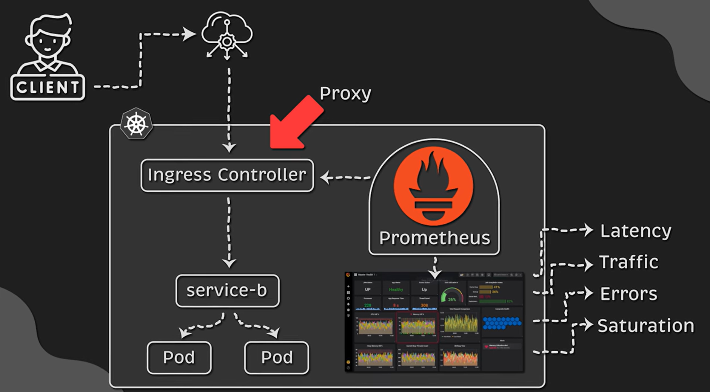

# Notes

## Monitoring with Prometheus and Grafana

### monitoring using nginx controller

- can use Prometheus and Grafana with nginx controller
- use Prometheus to collect metrics from nginx controller
- use Grafana to visualize and analyze metrics

### Monitoring using cloud controller

- can't use Prometheus and Grafana with AWS ELB
- you can use Prometheus but it will be a bit complex to setup and so expensive
- instead use CloudWatch for monitoring and use AWS X-Ray for tracing
