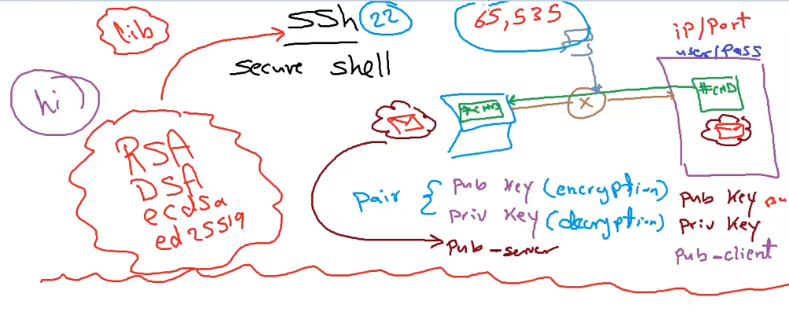

# SSH (Secure Shell)

+ it is a network protocol and cryptographic tool that allows secure remote access to computer systems over an unsecured network
+ It provides a secure channel for data communication, remote command execution, and other network services.
+ it's commonly used for server administration, deploying applications, and managing data pipelines.

## Key Components

+ `Client`: The machine from which you want to connect to another machine.
+ `Server`: The remote machine you want to access securely.
+ `SSH Client Software`: A program or tool on the client machine that initiates the SSH connection.
+ `SSH Server Software`: A program or service running on the server that listens for incoming SSH connections.

## Key Concepts

+ `Encryption`: SSH encrypts data transferred between the client and server, making it difficult for unauthorized parties to intercept or tamper with the data.

+ `Authentication`: SSH uses various methods for authentication,
including password-based authentication and public key authentication.

+ `Public Key Authentication`: This method involves generating a pair of cryptographic keys (public and private). The public key is placed on the server, and the private key remains on the client. The client uses its private key to prove its identity to the server.

+ `Port`: SSH typically uses port 22 for communication, but this can be configured differently for added security.

## How SSH Works

+ When you initiate an SSH connection, the client and server engage in a handshake to establish the parameters of the session.
+ Encryption keys are exchanged during this process, which will be used to encrypt and decrypt data.
+ Once the secure connection is established, you can run commands on the remote server, transfer files, or perform other tasks securely.

## Use Cases for Software Developers and Data Engineers

+ `Server Administration`: SSH is commonly used to manage and administer remote servers, including setting up and configuring web servers, databases, and other software.
+ `Deploying Applications`: You can use SSH to securely deploy applications to remote servers, ensuring that sensitive data and code remain protected during the transfer.
+ `Data Engineering`: SSH can be used to access and manage remote data sources, execute data processing tasks on remote clusters, and transfer data securely between systems.
